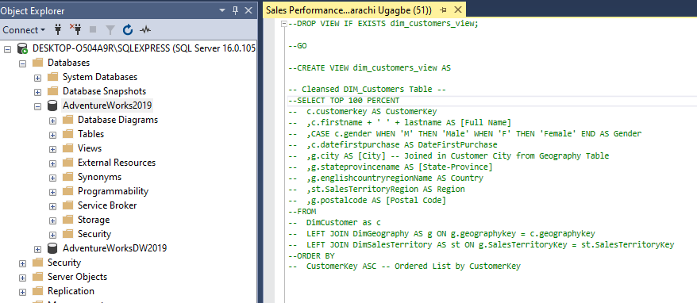
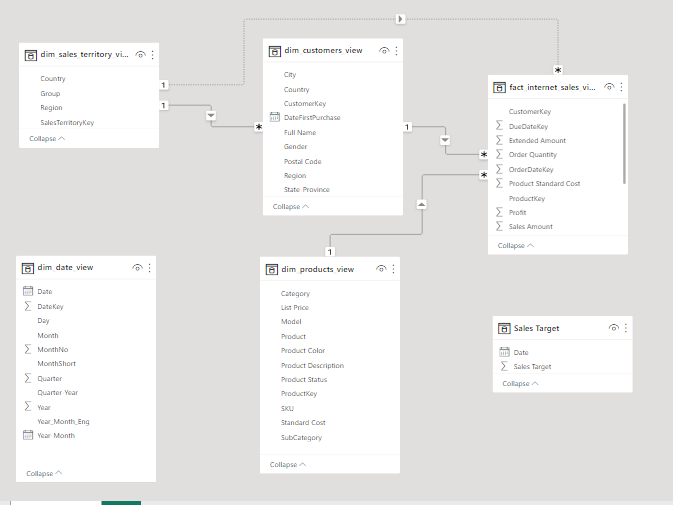

# Sales-Performance-Analysis
This is a project that shows my ability to query data from Adventure Works DW database and analyze with Power BI

## Introduction
This is an analysis of the Sales performance of AdventureWorksDW. It is done by analyzing data from different schemas on the AdventureWorks DWdatabase. I analyzed data from dim_customers table, dim_date table, dim_product table, dim_territory sales and fact_internet sales table. I used SQL to query the data from the database and imported into PowerBI where the actual analysis was carried out.
*Disclaimer* This is not a real company as we know that adventure works DW database is compiled by Microsoft for learning purposes.

## Problem Statement
The goal of this analysis is to
•	Determine the current market demand for products and how it varies by region/location
•	Know the current sales performance and how it compares to past performance and industry benchmarks
•	identify the areas where sales performance is lacking or could be improved.
•	To discover target markets or goods that have the greatest impact on sales success.
•	Finally, the goal is to create data-driven plans that can aid in increasing sales, improving customer happiness, and driving corporate growth.

## Data Source:
The data used for this work is gotten from the AdventureWorks 2019 database 2019. I studied the Schema, Objects related to the Schema, data dictionary and found the right tables for the analysis.
•	You can find a link to get download the data from [here:](https://www.kaggle.com/datasets/vivek468/superstore-dataset-final)

## Skills and Concepts demonstrated:
•	SQL (Select, alias, Views)
•	Power BI concepts like:
  o	creating columns for calculations for dates, time, and duration
  o	Creating key performance indicators (KPIs) and other business calculations,
  o	Developing general DAX calculations that deal with text and numbers,
  o	Performed advanced DAX calculations for solving statistical measures and other mathematical formulas
  o	Data Modelling,
  o	Measures,
  o	filters,
  o	tooltips,
  o	Page buttons,
  o	Data Visualization

## Data Transformation:
•	Several structured queries were written to get the right tables and then saved as views in the Database on SQL Management studio. The tables and views are:
•	Customers Table

Recreated Model                      |  Automated Model
:-------------------------------:    |   :-------------------------------------------:
              |   

